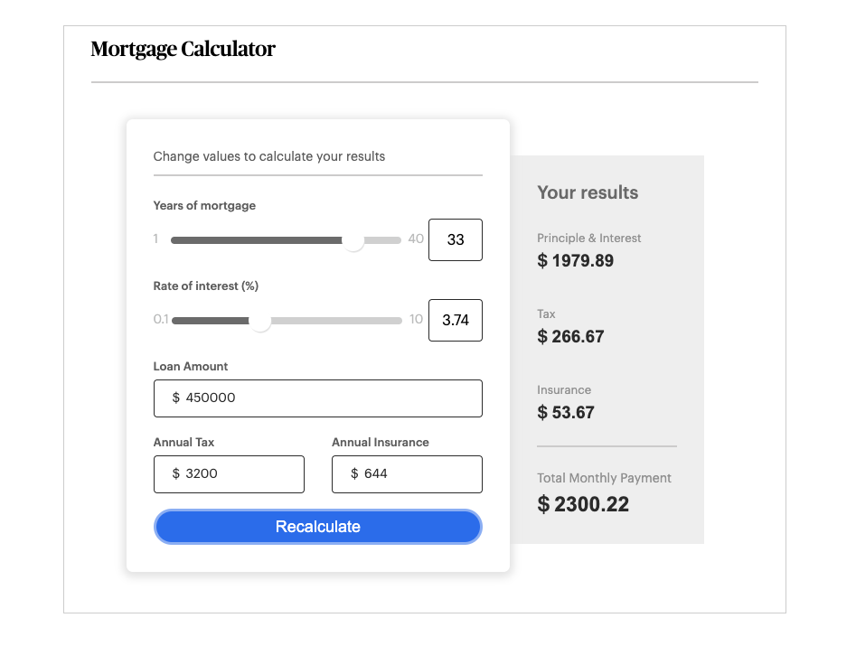

# mortgage-calculator
click here --> http://my-mortgage-calculator.surge.sh/ 
mortgage calculator challenge using vanilla js, html, css, sass, custom fonts, airbnb style and es6

### Table of Contents
- First Looks - Screenshots in Chrome
- Wireframes
- Bugs and Known Issues
- Next Steps to Continue
- Acceptance Criteria
- Bonus
- Deliverables

### First Looks - Screenshots in Chrome
# 
# 
# 
# 

### Wireframes
# 
# 
# 

### Bugs and Known Issues
# Lighter Color in dollar sign before click needs to be implimented
# On mobile: hide / show with annimation of results implimented
# Currency format: indent on comma when $ amt > 999

### Next Steps for App UI and Functionality
# Slider for Credit Score to estimate average Tax Rate
# API to Experian / Credit Karma for Credit Score
# drop down and or link to Taxes and Fees based on State / County / City
# Pie chart wheel with colors corresponding to P&I / HOA Ins / Taxes

## Next Steps for Code
# More responsive and browser compatibility
# Add more accessibilty (label ever form control / alt test / page lang idenity / all interactive elements keyboard accessible like sliders)
# test and clean up run time efficiency based on Google Analytics (organize acct structure / includes and excludes checklist ect..)
# Code Clean up CSS: set up global variables in SCSS for reusables (fonts, colors, headings and other elements ect...)
# Code Clean up JS: clean up functions / variables further for less code + more ES6

### Acceptance Criteria (MVP)
- 1. The calculator should match the design
- 2. The page should be responsive
- 3. Use HTML, JS (ES6 version) and SCSS
- 4. Should work in Chrome
- 5. Do not use any frameworks (CSS / Javascript)
- 6. Implement basic error handling as shown in the designs.
- 7. Submit the code to a private repository on Github

### Bonus
- 1. Transpile JS for compatibility with other browsers (Safari/iOS)
- 2. Use of the Airbnb style guide
- 3. Unit tests for critical functions
- 4. Use JSDocs 3 pattern for comments
- 5. Write a list of bugs or known issues for your implementation if needed
- 6. README file with instructions

### Deliverables
- 1. All source files (ES6 and SCSS)
- 2. HTML, JS and CSS files (unminified)

